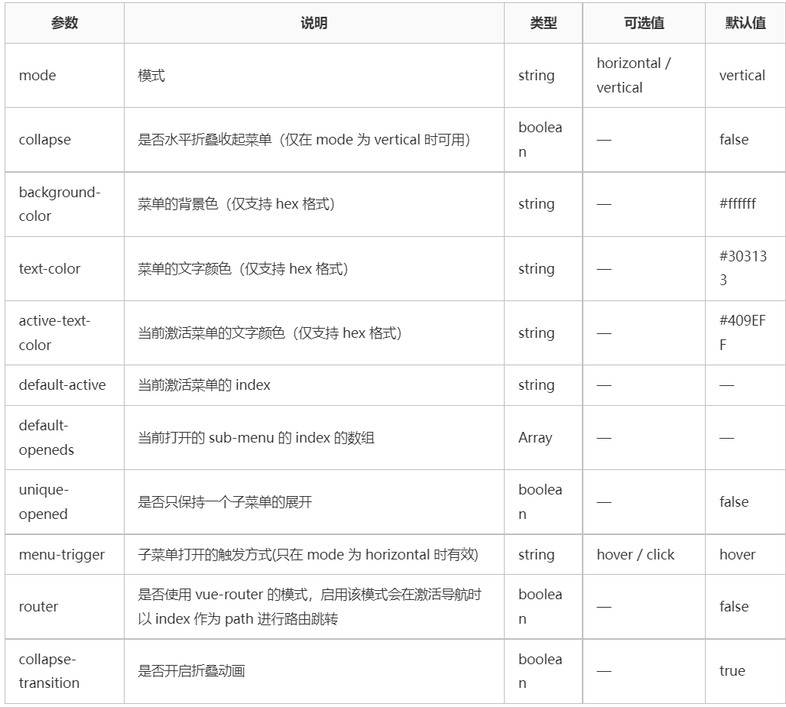

# cloud-music

仿照这位大佬的作品，，，，

作品细致到令人发指，估计我要花十多天才能吸收消化完。

https://github.com/RibsLi/CloudMusic-demo

也是我的第一个vue3.x的作品


### 第一天

2022年2月15日12:18:35

创建文件:

```js
vue create cloud-music
	vue3.x
	
	
	//package.json
依赖(dependencies)：{
	"axios": "^0.24.0",
    "core-js": "^3.6.5",
    "element-plus": "^1.1.0-beta.24",
    "qrcode.vue": "^3.3.3",				// 生成二维码
    "vue": "^3.0.0",
    "vue-router": "^4.0.0-0",
    "vuex": "^4.0.0-0"
}
```

#### vue.config.js

​	vue.config.js 是一个可选的配置文件，如果项目的 (和 package.json 同级的) 根目录中存在这个文件，那么它会被 @vue/cli-service 自动加载。你也可以使用 package.json 中的 vue 字段，但是注意这种写法需要你严格遵照 JSON 的格式来写。

在这里，他用到了`configureWebpack`，里面有`reslove`对象，包含alias对象，

```js
configureWebpack: {
    resolve: {
      alias: {
        'assets': '@/assets',
        'common': '@/common',
        'components': '@/components',
        'network': '@/network',
        'views': '@/views'
      }
    }
  }
```

最终这里面的配置会通过`webpack-merge`合并到最终的webpack配置中。

[链接](https://cli.vuejs.org/zh/guide/webpack.html#%E7%AE%80%E5%8D%95%E7%9A%84%E9%85%8D%E7%BD%AE%E6%96%B9%E5%BC%8F)

在原文档src下使用了tree,生成树，结构如下：

### src文件树

```tree
│  App.vue
│  main.js
│  
├─assets
│  ├─css
│  │  │  main.css
│  │  │  normalize.css
│  │  │  reset.css
│  │  │  
│  │  └─fonts
│  │          iconfont.css
│  │          iconfont.js
│  │          iconfont.json
│  │          iconfont.ttf
│  │          
│  └─images
│          1.jpg
│          logo.png
│          play_disc.png
│          play_needle.png
│          
├─common
│      utils.js
│      
├─components
│  ├─albumDetail			
│  │  │  AlbumDetail.vue			//专辑信息组件
│  │  │  
│  │  └─childComps
│  │          AlbumTable.vue
│  │          Comment.vue
│  │          DetailHeader.vue
│  │          
│  ├─aplayer						//底部音乐播放栏
│  │      Aplayer.vue
│  │      
│  ├─home		
│  │  │  Home.vue					//首页
│  │  │  
│  │  └─childComps
│  │          HomeHeader.vue		//首页顶部头栏
│  │          
│  ├─input
│  │      InputDetail.vue
│  │      
│  ├─mvDetail
│  │  │  MVDetail.vue				//单曲详细信息组件
│  │  │  
│  │  └─childComps
│  │          Comment.vue
│  │          DetailHeader.vue
│  │          
│  ├─myLike
│  │  │  MyLike.vue					//我的最爱组件
│  │  │  
│  │  └─childComps
│  │          Collect.vue
│  │          Comment.vue
│  │          DetailHeader.vue
│  │          TableData.vue
│  │          
│  ├─searchDetail
│  │  │  SearchDetail.vue			//搜索组件
│  │  │  
│  │  └─childComps
│  │          AlbumData.vue
│  │          Playlists.vue
│  │          SingerData.vue
│  │          SongData.vue
│  │          
│  ├─singerDetail					//歌手详细信息组件
│  │  │  SingerDetail.vue
│  │  │  
│  │  └─childComps
│  │          AlbumTable.vue
│  │          DetailHeader.vue
│  │          
│  ├─songDetail
│  │  │  SongDetail.vue				//歌曲详细信息组件
│  │  │  
│  │  └─childComps
│  │          Collect.vue
│  │          Comment.vue
│  │          DetailHeader.vue
│  │          TableData.vue
│  │          
│  └─songsList						//歌曲列表组件
│          index.js
│          SongsList.vue
│          SongsListItem.vue
│          
├─network							//重中之重，API请求网络资源
│      discovery.js
│      leaderboard.js
│      login.js
│      mv.js
│      recommends.js
│      request.js
│      search.js
│      singer.js
│      songdetail.js
│      user.js
│      
├─router							//路由信息，
│      index.js
│      
├─store								//组件状态管理库
│      actions.js
│      getters.js
│      index.js
│      mutations.js
│      
└─views					//暂时不知道为什么会出现这些？？？
    ├─allMV
    │      AllMV.vue
    │      
    ├─discovery
    │  │  Discovery.vue
    │  │  
    │  └─childComps
    │          Banners.vue
    │          Newest.vue
    │          Personalized.vue
    │          Recommend.vue
    │          RecommendMV.vue
    │          
    ├─exclusive
    │      Exclusive.vue
    │      
    ├─leaderboard
    │  │  Leaderboard.vue
    │  │  
    │  └─childComps
    │          Global.vue
    │          Official.vue
    │          
    ├─myCollect
    │  │  MyCollect.vue
    │  │  
    │  └─childComps
    │          AlbumTable.vue
    │          SingerTable.vue
    │          
    ├─mySongs
    │      MySongs.vue
    │      
    ├─newMV
    │      NewMV.vue
    │      
    ├─newSongs
    │  │  NewSongs.vue
    │  │  
    │  └─childComps
    │          Album.vue
    │          SongTableData.vue
    │          
    ├─profile
    │      Profile.vue
    │      
    ├─recommends
    │      Recommends.vue
    │      
    ├─singer
    │      Singer.vue
    │      
    └─topMV
            TopMV.vue
```

这个项目最关键的就是router了。

还有就是网易云音乐的相关API

https://neteasecloudmusicapi.vercel.app/#/?id=neteasecloudmusicapi

store里面封装的是对API的函数，都是重要的js文件。

具体到编码流程就是各种的实现逻辑了。


2022年2月15日17:07:16

我们首先理清`router/index.js`的内容，顺便复习vue-router的知识。

### 第二天

2022年2月16日14:29:18

`src/router/index.js`

```js
import { createRouter, createWebHashHistory } from "vue-router"

const Home = () => import("components/home/Home");
const Discovery = () => import("views/discovery/Discovery");
const Recommends = () => import("views/recommends/Recommends");
const NewSongs = () => import("views/newSongs/NewSongs");
const NewMV = () => import("views/newMV/NewMV");
const Leaderboard = () => import("views/leaderboard/Leaderboard");
const Singer = () => import("views/singer/Singer");
const MySongs = () => import("views/mySongs/MySongs");
const MyCollect = () => import("views/myCollect/MyCollect");
const SongDetail = () => import("components/songDetail/SongDetail")
const Exclusive = () => import("views/exclusive/Exclusive")
const AllMV = () => import("views/allMV/AllMV")
const TopMV = () => import("views/topMV/TopMV")
const SingerDetail = () => import("components/singerDetail/SingerDetail")
const MVDetail = () => import("components/mvDetail/MVDetail")
const AlbumDetail = () => import("components/albumDetail/AlbumDetail")
const SearchDetail = () => import("components/searchDetail/SearchDetail")
const MyLike = () => import("components/myLike/MyLike")
const Profile = () => import("views/profile/Profile")

const routes = [
    {
        path:"",
        redirect:'/home'
    },
    {
        path:"/home",
        component:Home,
        children:[
            { path: "", redirect: "/discovery" },
              { path: "/discovery", component: Discovery },
              { path: "/recommends", component: Recommends },
              { path: "/newSongs", component: NewSongs },
              { path: "/newMV", component: NewMV },
              { path: "/leaderboard", component: Leaderboard },
              { path: "/singer", component: Singer },
              { path: "/mySongs", component: MySongs },
              { path: "/myCollect", component: MyCollect },
              { path: "/songDetail", component: SongDetail },
              { path: "/exclusive", component: Exclusive },
              { path: "/allMV", component: AllMV },
              { path: "/topMV", component: TopMV },
              { path: "/singerDetail", component: SingerDetail },
              { path: "/mvDetail", component: MVDetail },
              { path: "/albumDetail", component: AlbumDetail },
              { path: "/searchDetail", component: SearchDetail },
              { path: "/myLike", component: MyLike },
              { path: "/profile", component: Profile },
        ],
    },
]

const router = createRouter({
	history:createWebHashHistory(),
	routes,
})

export default router;
```

这里我不明白的是，为什么使用import引入组件，我记得我学过的不是这样

是直接就引入了

```js
import seller from '../components/seller/seller'
import goods from '../components/goods/goods';
import ratings from '../components/ratings/ratings';
```

他这里还使用了一个const修饰的字符，变成了函数式地import。不知道为什么这样做。

[import](https://developer.mozilla.org/zh-CN/docs/Web/JavaScript/Reference/Statements/import)

对于vue-router的用法，可以总结为五大步：

```
1. 定义路由组件，或从其他文件导入
2. 定义一些路由，每个路由都需要映射到一个组件。这里面的复杂情况就是嵌套路由
3. 创建路由实例并传递 `routes` 配置，这里的配置可以复杂
4. 在第3步骤内部提供了 history 模式的实现。这里使用hash模式。
5. 创建并挂载根实例，这里在src/main.js里面实现。
```


在这五大步里，起到关键作用的就是第二步骤，定义路由。

这里的路由定义很有意思。根路由，重定位成‘/home’，也就是Home组件，剩下的主要组件都是根路由的子路由。这里的子路由们，或者叫子组件们，一同构成这个完善的网易云音乐项目。对于他们的具体了解和解释，我放在后面。

现在来看看，`vuex`的具体实现。

> Vuex 是一个专为 Vue.js 应用程序开发的**状态管理模式 + 库**。它采用集中式存储管理应用的所有组件的状态，并以相应的规则保证状态以一种可预测的方式发生变化。


`src/store/...`

```js
├─store						//组件状态管理库
│      actions.js			//根级别的action
│      getters.js			//根级别的getter
│      index.js				//组装模块并导出store的地方
│      mutations.js			//根级别的mutation
```

这里面将vuex中的几大核心概念抽离出来，当然，state这个概念在index.js里面。

我们可以看一下state的内容：

```js
state: {
    // songId: ['1891469546'],
    songDetail: [
      {
        id: "448596416",
        name: "At The Edge",
        ar: [
          {
            id: 12138261,
            name: "千坂",
          },
        ],
        dt: "200644",
        al: {
          id: 35072236,
          name: "At The Edge",
          picUrl:            "https://p2.music.126.net/j0kTkSQDEn3MksdJ3S3BSQ==/109951163825143640.jpg",
        },
      },
    ],
    serachData: [],
    keywords: {},
  },
```

这里是写好的一个默认的歌曲的细节，还包括了所属专辑的信息。


在`mutations.js`中只有几个方法：

```js
  addSongDetail(state, payload) {
    // console.log(payload);
    state.songDetail.push(...payload)
  },
  subSongDetail(state, payload) {
    state.songDetail = payload
  },
  remove(state) {
    // state.songId = []
    state.songDetail = []
  },
  serachData(state, payload) {
    state.serachData = payload
  },
  keywords(state,payload) {
    state.keywords = payload
  },
```

暂时没弄明白这些方法都是用做什么的。

在`getter.js`里面，发现了**null**

```null

```

在`actions.js`里面发现了一些东西。

```js
import { getPlaylistDetail, getSongDetail } from "network/songdetail";

export default {
  addSong(context, payload) {
    // const obj = {}
    let trackIds = []
    let tableData = []
    // 获取歌单详情
    if(payload.length > 1) {
      getPlaylistDetail(payload).then(res => {
        // console.log(res);
        res.data.playlist.trackIds.forEach(item => {
          trackIds.push(item.id)
        })
        getSongDetail(trackIds).then(res => {
          tableData = res.data.songs;
        })
      })
    } else {
      getSongDetail(payload).then(res => {
        console.log(res);
        tableData.push(...res.data.songs);
      })
    }
    console.log(tableData);
    context.commit("addSong", tableData)
  },
};
```

这里拢共就一个方法`addSong(context,payload)`。

看来也就只能从`network`文件夹里面找出信息了。

------

其实，在vuex教程的进阶篇—>项目结构里面就已经给出了借鉴。

https://vuex.vuejs.org/zh/guide/structure.html

他提出了一些我们值得遵守的规则。

- 应用层级的状态应该集中到单个 store 对象中。
- 提交 **mutation** 是更改状态的唯一方法，并且这个过程是同步的。
- 异步逻辑都应该封装到 **action** 里面。
- 如果store文件太大，只需要将action、mutation和getter分割到单独的文件里面。

在这个项目里面，整个vuex做的事情就只是获得歌曲信息。state里面只需要准备好歌曲的detail就好了，mutation里面准备好状态更改的方法就好，action准备提交(context.commit('addSong'))就好了。至于getter，在有API请求存在的情况下，他已经失去了作用，本来他就类似于是关于state的计算属性。:poop:

------

所以说，我们的工作量又回到`network/...`文件中去：

```
├─network							//重中之重，API请求网络资源
│      discovery.js
│      leaderboard.js
│      login.js
│      mv.js
│      recommends.js
│      request.js
│      search.js
│      singer.js
│      songdetail.js
│      user.js
```

我们先处理一下vuex设计的两个方法。在`network/songdetail.js/{getPlaylistDetail, getSongDetail}`

```js
import {request} from './request'
...
...

// 获取歌单详情
export function getPlaylistDetail(id) {
  return request({
    url: "/playlist/detail",
    params: {
      id
    }
  })
}
//获取所有歌曲列表
export function getSongDetail(...id) {
  return request({
    url: `/song/detail?ids=${id}`
  })
}
```

好巧不巧，这TNND又涉及到`request.js`，不过，根据名称我们知道，离最终的结果不远了。

在这里，我们看到，这两个方法都很简单，拿到参数就传出去了，当然是包装成一个单一的对象返回一段模板字符串。最终传给了导入的request方法。

大胆猜测，network文件夹下的大部分js文件其实就是做了一个URL请求的拼装。主事的只是`request.js`。

在`request.js`里，又用到了我们的老朋友`axios`。

看起来此处的axios涉及的知识点我还没有涉及过。

2022年2月16日22:13:44

使用自定义配置新建一个实例：

```js
const instance = axios.create({
  baseURL: 'https://some-domain.com/api/',
  timeout: 1000,
  headers: {'X-Custom-Header': 'foobar'}
});
```

对应的：

```js
const instanca = axios.create({
    baseURL: 'https://lianghj.top:3000',
    timeout: 5000
  })
```

更为关键的是，这个js文件里面使用了axios拦截器：请求拦截器和响应拦截器。

对应教程链接：https://www.axios-http.cn/docs/interceptors

一个比较不错的案例讲解:https://blog.csdn.net/qq_42899245/article/details/107876734

- 请求拦截器
  在请求发送前进行必要操作处理，例如添加统一cookie、请求体加验证、设置请求头等，相当于是对每个接口里相同操作的一个封装；
- 响应拦截器
  同理，响应拦截器也是如此功能，只是在请求得到响应之后，对响应体的一些处理，通常是数据统一处理等，也常来判断登录失效等。例如在服务器返回登录状态失效，需要重新登录的时候，跳转到登录页。

```js
//axios拦截器:请求拦截，响应拦截
  instanca.interceptors.request.use(config => {
    // console.log(config);
    return config
  },err => {
    console.log(err);
  });

  //响应拦截
  instanca.interceptors.response.use(res => {
    // console.log(res);
    return res
  },err => {
    console.log(err);
  });
```

额外提到的就是，这个网易云音乐的API使用的是**CSRF - 跨站请求伪造**技术。

我是第一次听说这种技术。

`CSRF`是跨站请求伪造的缩写，也被称为`XSRF`， 是一种挟制用户在当前已登录的**Web**应用程序上执行非本意的操作的攻击方法。
跟跨网站脚本（**XSS**）相比，**XSS**利用的是用户对指定网站的信任，**CSRF**利用的是网站对用户网页浏览器的信任。
**因为CSRF攻击利用的是冲着浏览器分不清发起请求是不是真正的用户本人。**，也就是说，简单的身份验证只能保证请求发自某个用户的浏览器，却不能保证请求本身是用户自愿发出的。

[链接](https://zhuanlan.zhihu.com/p/37293032)

### 第三天

2022年2月17日13:56:26

现在这个axios的拦截器很有意思，搞得我想先下手试试水。

事实就是，算了吧。我对于整个API都不明白，理解store/actions简直难上登天。

今天把API理解清楚。

```tree
├─network					//重中之重，API请求网络资源
│      discovery.js			//确定这是首页数据的请求，也就是Home	
│      leaderboard.js		//这是排行榜单的数据请求
│      login.js				//显然，这是用作登陆的
│      mv.js				//这是最新MV的数据请求
│      recommends.js		//这是推荐歌单的数据请求
│      request.js			//这位是重量级
│      search.js			//看来这是专门处理搜索的
│      singer.js			//这是热门歌手的数据请求
│      songdetail.js		//这不再是榜单了，而是歌手详细信息
│      user.js				//这是登录用户的数据请求
```

目前可以了解，只有`request.js`是重中之重。其他的是拼装。

可以看出，这里的请求刚好一一对应首页中的榜单，也对应相关的组件。

接下来就是了解一下，API的请求URL的构成。

然后是，请求到的数据的结构。

```
URL构成：baseURL: 'https://lianghj.top:3000' + url: "/cloudsearch"
```

```
这是网易云音乐网站的真实链接：
		https://music.163.com/#/discover/toplist
这是项目的链接
		http://localhost:8080/#/leaderboard
```

在组件Leaderboard中，引入了`{ getToplist } from "network/leaderboard"`

在network/leaderboard.js中，除了引入`{request} from './request'`，唯一暴露出的方法`getToplist()`只是返回导入的`request`,唯独加了一个配置对象{ url:"/toplist"},

在request.js里面，请求拦截器也只是接受到配置之后就返回了出去。

源码里面`util/request.js`里面存在一个方法`createRequest(method, url, data, options)`,我想正是在这里，url和baseURL才可以拼装完成。不过这也只是我的猜测，但是源码实在是没有给我更多的信息。

这下我们算是了解了请求URL的组成和对应请求到的json数据的数据结构。源码里面给了几张截图，我把他放到了同级下的JSON结构文件夹里面。

2022年2月17日17:51:07

### 第四天

2022年2月18日14:45:33

今天的任务呢，把首页数据做完吧。尝试跑一下。二三十个组件，我打算先照抄＋理解，然后在自己试着写一下。顺带着学一下element-plus

`window.sessionStoreage`

#### window

https://developer.mozilla.org/zh-CN/docs/Web/API/Window

`window` 对象表示一个包含DOM文档的窗口，其 `document` 属性指向窗口中载入的 [DOM文档](https://developer.mozilla.org/zh-CN/docs/Web/API/Document) 。使用 [`document.defaultView`](https://developer.mozilla.org/zh-CN/docs/Web/API/Document/defaultView) 属性可以获取指定文档所在窗口。

`window`作为全局变量，代表了脚本正在运行的窗口，暴露给 Javascript 代码。

在有标签页功能的浏览器中，每个标签都拥有自己的 `window` 对象；也就是说，同一个窗口的标签页之间不会共享一个 `window` 对象。有一些方法，如 [`window.resizeTo`](https://developer.mozilla.org/zh-CN/docs/Web/API/Window/resizeTo) 和 [`window.resizeBy`](https://developer.mozilla.org/zh-CN/docs/Web/API/Window/resizeBy) 之类的方法会作用于整个窗口而不是 `window` 对象所属的那个标签。一般而言，如果一样东西无法恰当地作用于标签，那么它就会作用于窗口。

##### window.sessionStoreage

`sessionStorage` 属性允许你访问一个，对应当前源的 session [`Storage`](https://developer.mozilla.org/zh-CN/docs/Web/API/Storage) 对象。它与 [`localStorage`](https://developer.mozilla.org/zh-CN/docs/Web/API/Window/localStorage) 相似，不同之处在于 `localStorage` 里面存储的数据没有过期时间设置，而存储在 `sessionStorage` 里面的数据在页面会话结束时会被清除。

```js
// 保存数据到 sessionStorage
sessionStorage.setItem('key', 'value');     // key:value

// 从 sessionStorage 获取数据
let data = sessionStorage.getItem('key');

// 从 sessionStorage 删除保存的数据
sessionStorage.removeItem('key');

// 从 sessionStorage 删除所有保存的数据
sessionStorage.clear();
```

------

重做吧！！！！！！！！

不想说了，我真是个榆木脑袋，直接就把文件删除了，还好typora有自动备份功能。

### 第五天

恶心啊，没想到`element-plus`的button不可以使用vue自带的@click，只可以使用onclick，也就是原点击处理函数，然后他就会报错。

```text
Uncaught ReferenceError: isToggle is not defined
    at HTMLLabelElement.onclick
```

真坑人。

恶心，element-plus的教程真把我难住了，我一下午的努力全没了，只能看看，elementUI的表现如何，或许是要从这里学起。

### 第六天

2022年2月22日15:23:47

Element Plus 的icon图标使用要单独安装模块

```
npm install @element-plus/icons-vue
```

[图标资源](https://element-plus.org/zh-CN/component/icon.html#%E5%9B%BE%E6%A0%87%E9%9B%86%E5%90%88)


`<el-menu>`标签属性：https://cloud.tencent.com/developer/section/1489896



`Home.vue`

主页结构如下

```js
el-header	--HomerHeader.vue
el-container
	el-aside
	el-main
el-footer	--Aplayer.vue
```

### 第七天

2022年2月23日15:44:00

```
├─discovery
    │  │  Discovery.vue
    │  │  
    │  └─childComps
    │          Banners.vue
    │          Newest.vue
    │          Personalized.vue
    │          Recommend.vue
    │          RecommendMV.vue
```

攻坚到`views/discovery/Discovery.vue`组件

这个项目很有意思的是，甚至把每一个页面，按照el-aside和el-main分离成两个部分。这样的好处就是更大的实现组件复用，或者叫解耦合。

气人啊，太难了！！！！！

尽快结束把！！！！！！！！！

难度太大了！！！！！！！！！！！！！

2022年2月23日16:56:37

### 第八天

2022年2月26日13:11:23

结束啦，这个难度太大了，做到最后也只是一比一复制，而且还会占据我现在的复习时间。换一个吧。这一个就先搁置了！！！！！！！！

